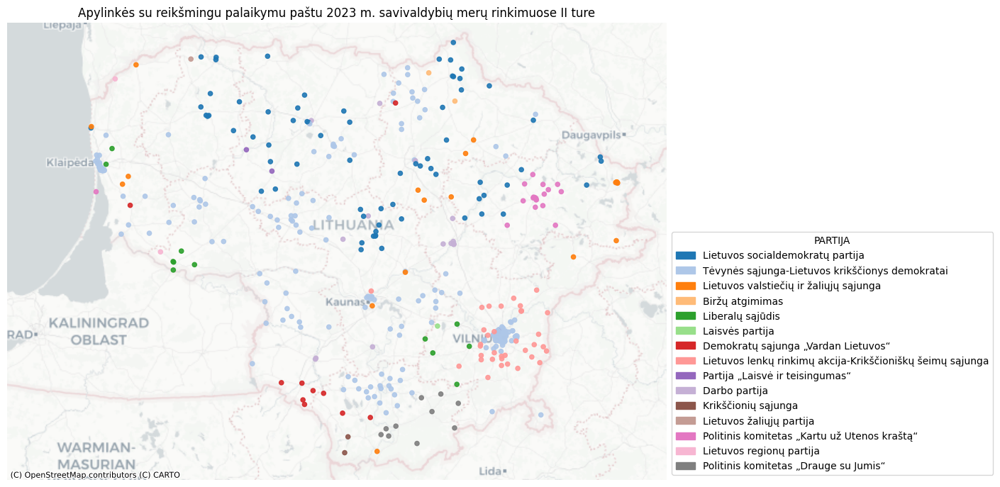

Here I solved interview tasks for Data analytics for Lithuanian national data agency for 2023 year in Python.
I attach solution for Junior and Mid-level tasks.

Junior is evaluation of elections and referendums outcomes according to Lithuanian laws. I used usual Python code here.

Mid-level is evaluation of 2nd round of elections which were held at 2023 year for the mayor of the municipality. 
Here I used Pandas, GeoPandas, Matplotlib, Contextily libraries, and proportions_ztest function from statsmodels.stats.proportion.

