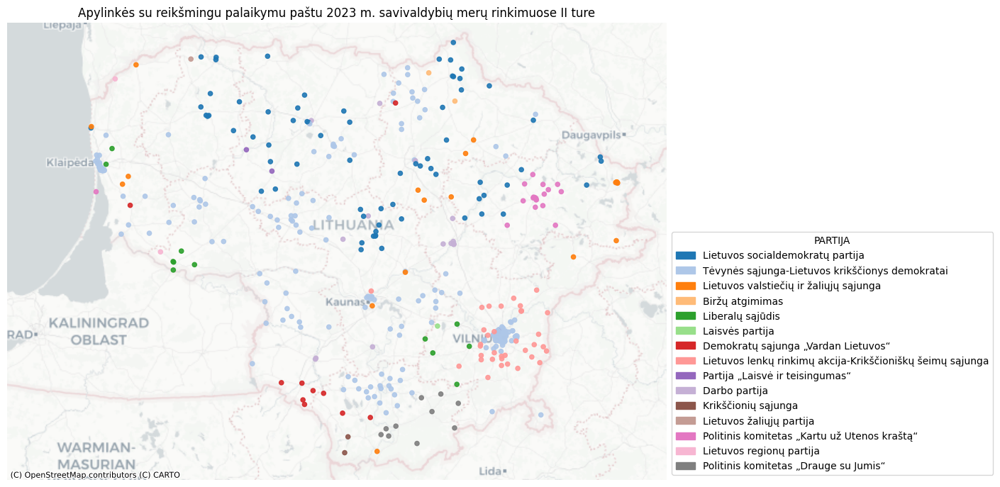

Here I solved interview tasks for Data analytics for Lithuanian national data agency for 2023 year in Python.
I attach solution for Junior and Mid-level tasks.

### Junior 

Made Python code with conditional logic (if...else) for evaluation of election’s (presidential, mayor, Seimas) and referendum’s (consultative, mandatory, constitutional) outcomes based on Lithuanian electoral laws. User inputs total number of registered voters in election district, number of voters who participated, candidate’s name and his votes count at election or votes count for passing the decision on referendum. And then user gets the answer: which candidate won or if there will be 2nd round of election or if the decision will be passed into motion.

### Mid-level 

Analyzed the 2023 2d-round mayor of municipality elections results with a focus on voter’s support via mail:
•	Created a new dataframe to identify candidates with statistically higher support via mail in a municipality using proportions_ztest from Statsmodels
•	Visualized election data for statistically higher support via mail in a district on a map of Lithuania using GeoPandas, Matplotlib, and Contextily

