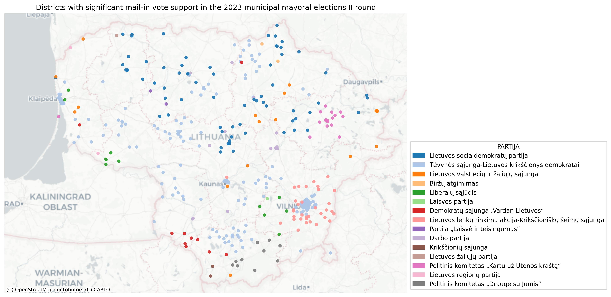

### Analysis of 2023 Lithuania municipality elections results using Python.
#### Used Python libraries: Pandas, GeoPandas, Matplotlib, and Contextily
#### Methods: proportions_ztest from Statsmodels, geospatial visualization

### 1.	Interactive Outcome Script:  
    Developed Python code with conditional logic for evaluation of election’s (presidential, mayor, Seimas) and referendum’s (consultative, mandatory, constitutional) outcomes based on Lithuanian laws. User makes inputs—registered voters, participation, candidate name and vote count (or referendum “yes”/“no” count) and gets the result:
a.	Winning candidate or need for a second round of election; passing the proposal into motion or rejecting proposal on referendum.
b.	Whether a referendum passes or fails due to vote share and turnout thresholds

### 2.	Statistical Analysis of mail-in support at 2023 municipalities II round of elections:
a.	Grouped data by municipality, candidate’s surname and party 
b.	Conducted proportion z-test to identify candidates who received statistically higher support via mail in a municipality.
c.	Filtered results with pval < 0.05.
d.	Created new .csv file for significant candidates.

### 3.	Geospatial Visualization:
a.	Conducted proportion z-test to identify parties who received statistically higher support via mail in a district.
b.	Filtered results with pval < 0.05.
c.	Merged election’s results data with geospacial coordinates for plotting.
d.	Mapped parties with statistically significant mail-in support in districts over a tiled Lithuania basemap using GeoPandas + Contextily.

### 4.	Key Insight:  
a.	Lietuvos socialdemokratų partija got more mail-in support in Central and North LT.
b.	Lietuvos lenkų rinkimų akcija-Krikščioniškų šeimų sąjunga  got higher mail-in support in Vilnius region.
c.	Tėvynės sąjunga-Lietuvos krikščionys demokratai got more support via mail all across LT, especially in Vilnius and Klaipeda.

